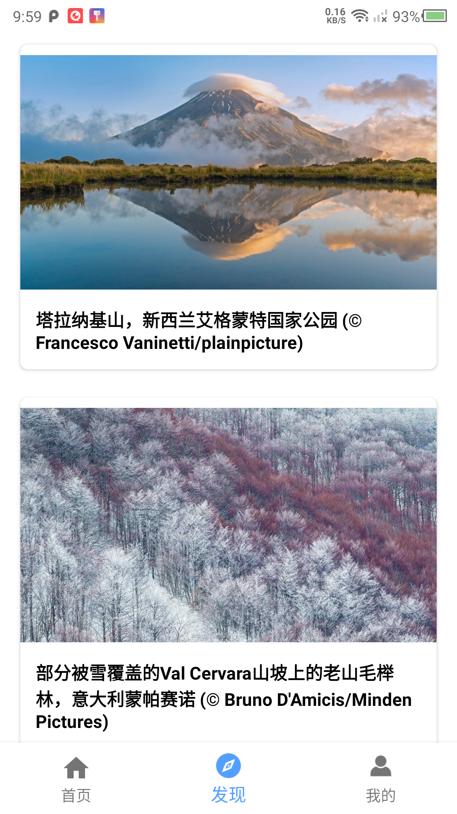
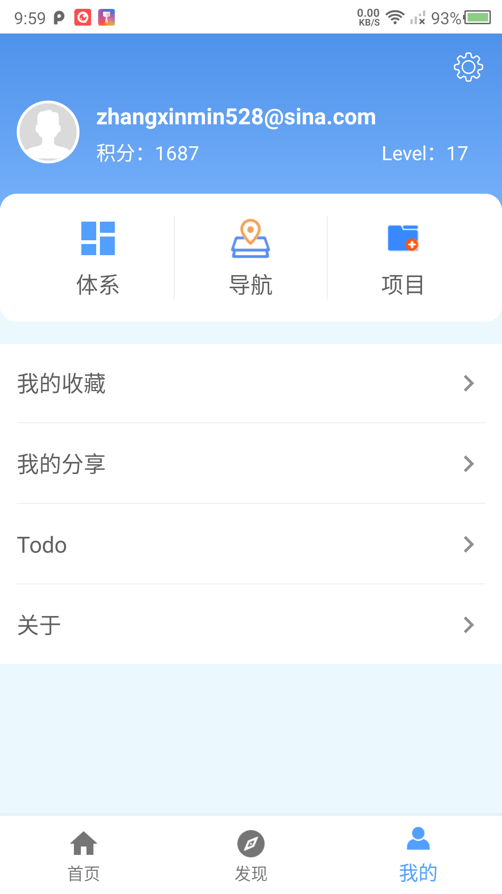
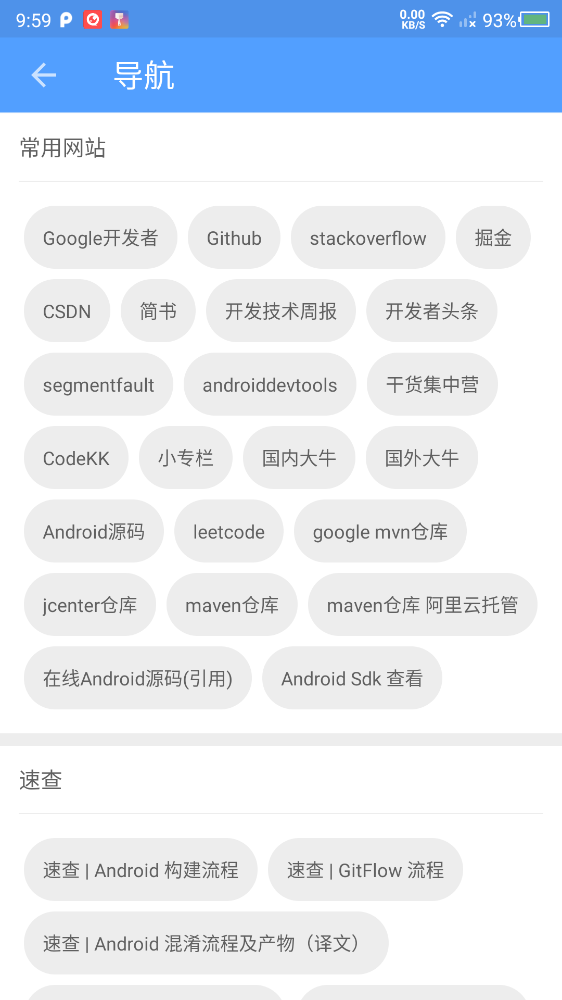
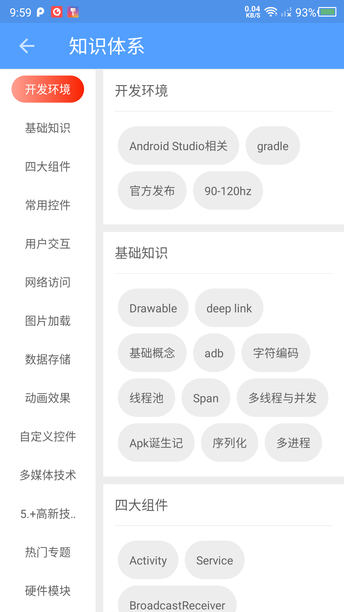
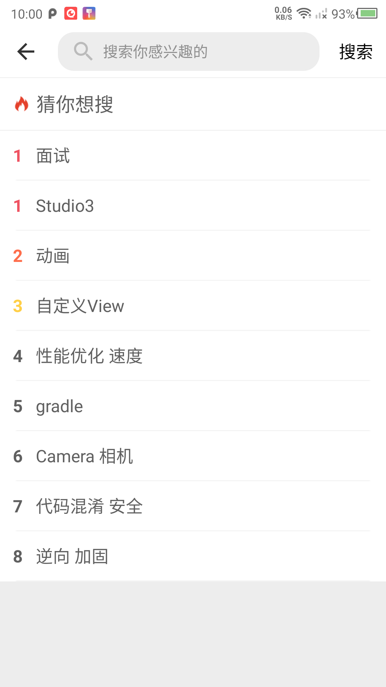
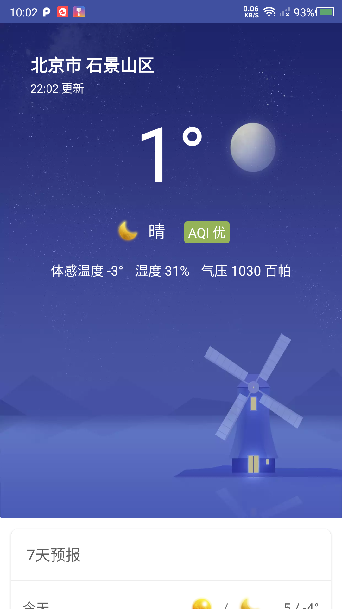

# WanAndroid

- 项目整体使用Kotlin语言编写
- Android Jetpack的使用，包含但不仅限于LifeCycle,LiveData,ViewModel等
- 项目的整体功能架构主要是根据自己对于Android学习的一些习惯集成，包含但不仅限于以下模块：
	* 首页：文章系列，提供搜索功能，和当前定位城市的天气信息；
	* 发现：为Bing的精美壁纸大图，放松一下忙碌了一天的身心；
	* 我的：提供体系，导航以及项目等功能，方便去查阅感兴趣的领域；设置里面提供了语言选择，字体大小设置，缓存清理等功能；

ScreenShots
------

数据来源
------
- Android知识类文章数据主要来源于[WanANdroid](https://www.wanandroid.com/blog/show/2)
- 壁纸数据来源于[Bing](https://cn.bing.com/)
- 天气数据来源于[和风天气](https://dev.qweather.com/)

License
-------

Copyright 2020 ZhangXinmin.Open source code is for learning use only, not for commercial use.

Licensed to the Apache Software Foundation (ASF) under one or more contributor
license agreements.  See the NOTICE file distributed with this work for
additional information regarding copyright ownership.  The ASF licenses this
file to you under the Apache License, Version 2.0 (the "License"); you may not
use this file except in compliance with the License.  You may obtain a copy of
the License at

  http://www.apache.org/licenses/LICENSE-2.0

Unless required by applicable law or agreed to in writing, software
distributed under the License is distributed on an "AS IS" BASIS, WITHOUT
WARRANTIES OR CONDITIONS OF ANY KIND, either express or implied.  See the
License for the specific language governing permissions and limitations under
the License.